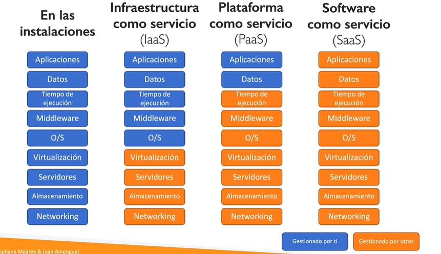
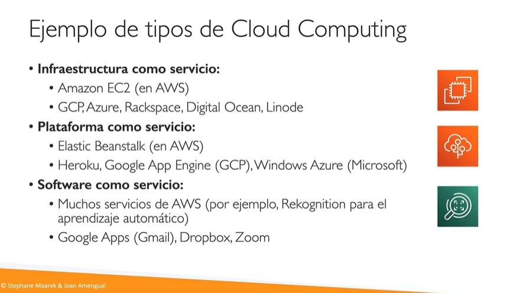
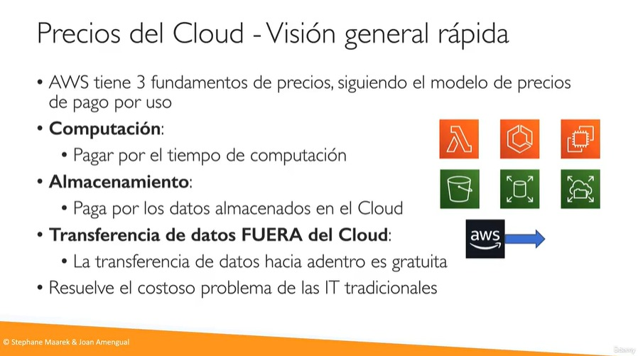
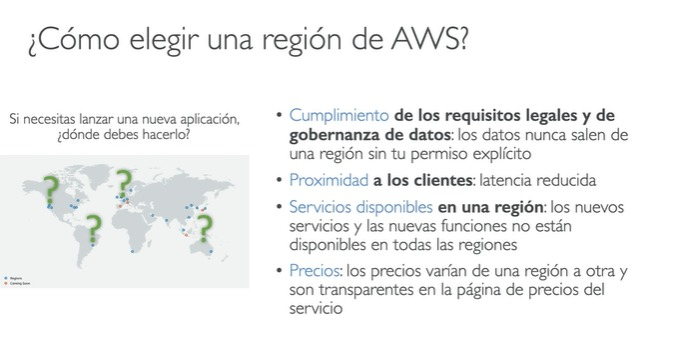
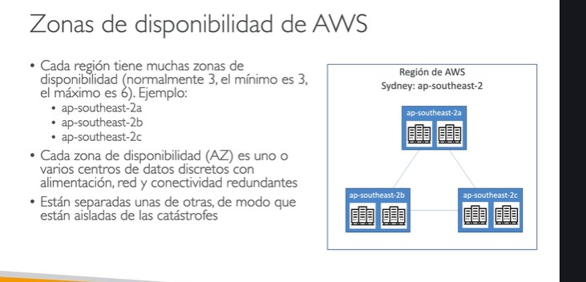
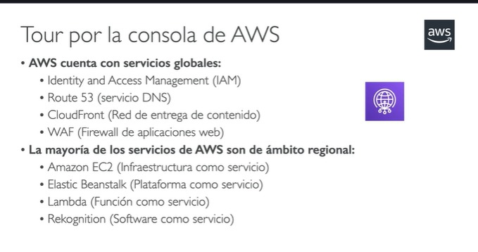
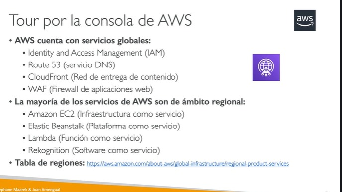

## IaaS, PaaS y SaaS

Son modelos de Cloud Computing que definen **qué tanto administra el proveedor cloud y qué tanto administras tú**.

---

# 1. IaaS — Infrastructure as a Service

Infraestructura como servicio.

El proveedor te da:

- máquinas virtuales,
- red,
- almacenamiento,
- CPU,
- RAM.

Pero tú administras:

- sistema operativo,
- Docker,
- runtime,
- aplicación,
- seguridad del servidor,
- despliegues.

---

## Ejemplo típico

Amazon Elastic Compute Cloud EC2

AWS te entrega una VM Linux vacía.

Tú haces:

```bash id="g63w6l"
sudo apt install java
sudo apt install docker
```

y despliegas tu app.

---

## Analogía

Te alquilan un terreno vacío.

Tú construyes la casa.

---

## Ventajas

- Máximo control.
- Muy flexible.
- Sirve para arquitecturas complejas.

## Desventajas

- Más mantenimiento.
- Más DevOps.
- Más responsabilidad.

---

# 2. PaaS — Platform as a Service

Plataforma como servicio.

El proveedor administra:

- servidores,
- sistema operativo,
- escalado,
- runtime,
- infraestructura.

Tú solo subes tu aplicación.

---

## Ejemplos

- AWS Elastic Beanstalk
- Heroku
- Google App Engine

---

## Ejemplo

Subes:

```text id="c2r8fr"
app.jar
```

y la plataforma:

- instala Java,
- levanta servidores,
- expone puertos,
- escala.

---

## Analogía

Te entregan una casa ya construida.

Solo llevas tus muebles.

---

## Ventajas

- Deploy rápido.
- Menos administración.
- Ideal para productividad.

## Desventajas

- Menos control.
- Menos personalización.
- Puede ser más caro.

---

# 3. SaaS — Software as a Service

Software como servicio.

No administras nada técnico.

Solo usas el software.

---

## Ejemplos

- Google Workspace
- Notion
- Slack Technologies
- Dropbox

---

## Analogía

Vas a un hotel.

Solo usas el servicio.

---

# Comparación rápida

| Modelo | Tú administras | Ejemplo |
| ------ | -------------- | ------- |
| IaaS   | Casi todo      | EC2     |
| PaaS   | Solo tu app    | Heroku  |
| SaaS   | Nada técnico   | Gmail   |

---

# En backend moderno

Muy común:

| Necesidad                  | Modelo |
| -------------------------- | ------ |
| Máximo control             | IaaS   |
| Deploy rápido              | PaaS   |
| Herramientas empresariales | SaaS   |

---

# Docker y Kubernetes

Docker puede correr en:

- IaaS → EC2
- PaaS → Render/Heroku
- CaaS (Containers as a Service) → ECS/Kubernetes

---

# Lo más usado hoy

En empresas modernas:

- EC2 → infraestructura base
- Docker → empaquetado
- Kubernetes/ECS → orquestación
- SaaS → herramientas de negocio

Todo mezclado.

Amazon Web Services tiene una infraestructura global y vamos a ver cuatro conceptos para entender cómo

se compone la infraestructura de Amazon.

En primer lugar, tenemos regiones.

En cada región vamos a encontrar zonas de disponibilidad y en cada zona de disponibilidad tenemos diferentes

centros de datos.

Además, hay que entender el concepto de edge location o punto de presencia.

Básicamente estos conceptos los veremos en profundidad durante el curso.

No te preocupes porque son conceptos muy relevantes.

Al final, lo que estamos obteniendo con todo esto es una infraestructura global distribuida por todo

el mundo.

Y si nos vamos al enlace que te dejo en esta misma diapositiva, lo que puedes encontrar son las zonas

de disponibilidad y las regiones de todo el mundo de Amazon Web Services.

Aquí tenemos las regiones marcadas en verde y lo que vendrá próximamente está marcado en rojo.

Podemos ver el número de zonas de disponibilidad que tenemos en cada región.

En este caso tenemos tres, aquí tenemos tres, aquí tenemos seis.

Entonces nosotros podemos ir a América del Norte, América del Sur, Europa, Medio Oriente, África,

Asia Pacífico o incluso Australia y Nueva Zelanda.

Y podemos analizar tal que aquí el número de zonas de disponibilidad en cada región.

Las zonas locales, etcétera son conceptos que veremos en profundidad durante este curso.

No te preocupes por ello, pero el concepto que quiero que obtengas de aquí es que la infraestructura

de AWS es totalmente global.

Entonces, AWS tiene regiones en todo el mundo.

Una región recoge un nombre único, por ejemplo, una región muy famosa, la región del norte de Virginia,

que recoge el nombre de US East uno.

Pero tenemos regiones en Europa, en Asia, por todo el mundo.

Entonces cada región tiene un nombre único.

Aquí tenemos la lista de regiones que nos va a aparecer en el dashboard y esta lista puede cambiar,

ya que AWS cada vez va añadiendo más y más regiones.

Entonces, una región que es pues es un grupo de centros de datos.

La mayoría de los servicios de Amazon Web Services que nosotros veremos son de ámbito regional.

No obstante, hay algunos servicios que son de ámbito global.

Vamos a entender qué significa esto a la perfección a medida que vamos avanzando en esta misma clase.

Y una pregunta que puede surgir en el examen de certificación es cómo elegir una región de AWS?

Tenemos varias.

Tenemos regiones en todo el mundo.

Entonces, por qué debo elegir una o por qué debo elegir otra?

Pues hay varios conceptos que nos van a permitir a nosotros elegir una región u otra.

El primer concepto es el concepto de cumplimiento de requisitos legales y de gobernanza de datos, ya

que los datos son un concepto relevante a la hora de elegir una región.

Los datos nunca salen de una región sin tu permiso explícito y nosotros podemos elegir una región u

otra en función de los requisitos legales de estos datos.

Todo seguido.

Punto número dos y muy importante, la proximidad a los clientes.

Nosotros queremos que los clientes accedan a las aplicaciones, accedan a los datos, a las páginas

web, pues con la mínima latencia, con el mínimo tiempo de espera.

Pues esto es un concepto importante.

Si yo tengo clientes en Europa, pues seguramente me interese que mi región de Amazon Web Services esté

en Europa.

Todo seguido.

Vamos a hablar del concepto de servicios disponibles en una región.

Cada región es independiente de otra región.

Puede ser que un servicio esté disponible en una región o no esté disponible en otra región.

Entonces, en función de qué servicios estoy utilizando, yo voy a elegir una región u otra.

Entonces, los nuevos servicios y nuevas funciones normalmente no suelen estar disponibles en todas

las regiones de todo el mundo de Amazon Web Services.

Empiezan poco a poco, pues es ahí donde yo debo elegir con criterio y finalmente los precios.

Y si los precios son diferentes en función de la región.

Y eso parece una tontería al principio, pero ya te digo que no lo es.

Debo elegir en función de lo que quiera pagar.

Los precios pueden ser similares, pero pueden variar bastante en función de una región u otra.

Hay una tabla de precios que me va a permitir a mí, pues diferenciar qué servicios valen un precio

o valen otro en función de la región.

Cada región está compuesta por diferentes zonas de disponibilidad.

Normalmente son tres zonas de disponibilidad por región.

Lo mínimo definido por AWS son tres zonas y el máximo son seis.

Por ejemplo, aquí encontramos lo que sería una zona de disponibilidad en la región de AP Southeast

y recoge el nombre de 2A2B2C.

Entonces, en la región de Sydney, que tiene el nombre de AP Southeast dos, vamos a encontrar tres

zonas de disponibilidad.

Esto es un ejemplo para que veas que dentro de una región hay diferentes zonas de disponibilidad.

Y qué es una zona de disponibilidad?

Pues cada zona de disponibilidad representa uno o varios centros de datos discretos con alimentación,

red y conectividad totalmente redundantes.

Estas zonas de disponibilidad están totalmente separadas unas de otras y eso se debe a un motivo, porque

en caso de catástrofe, por ejemplo, imagínate que haya un tsunami, pues una zona de soledad se puede

ver afectada, pero la otra zona de disponibilidad.

No se verá afectada porque están separadas geográficamente.

Esta forma nos aseguramos que los datos están siempre bien almacenados y bien replicados en diferentes

zonas en una misma región.

Y finalmente, estas zonas de disponibilidad están conectadas con redes de alto ancho de banda y latencia

ultrabaja.

Todo seguido vamos a hablar de las famosas H Locations, conocidos como puntos de presencia.

Amazon tiene más de 450 puntos de presencia compuestos con más de diez cachés regionales en más de 90

ciudades de más de 40 países.

De esta forma, el contenido se puede entregar a los usuarios finales con una menor latencia, con un

menor tiempo de espera para los usuarios y eso mejora muchísimo la experiencia del usuario.

Si nos vamos a este enlace que tenemos aquí, lo que podemos encontrar son las características que acabamos

de describir.

Estos números van a cambiar durante el tiempo, van a incrementarse porque cada vez Amazon Web Services

va creciendo y creciendo.

Entonces en este mapa podemos encontrar estas famosas h Locations que nos permiten llegar a los usuarios

de una forma más rápida.

Aquí tenemos la descripción de las edge Locations de las cachés regionales distribuidas por todo el

mundo en América del Norte, Europa, Asia, Australia, Nueva Zelanda, América del Sur, Oriente Medio,

África y China.

Y qué te parece si ahora vamos a ver un tour por la consola de AWS?

Antes de empezar este tour te voy a introducir un concepto muy relevante para el examen de certificación

y es que los servicios pueden ser de ámbito global o de ámbito regional.

Los servicios globales son cuatro.

Por favor, recuérdalos.

El primero es IAM, que viene de Identity and Access Management.

Es un servicio que nos va a permitir controlar el acceso a nuestra cuenta de Amazon Web Services y además

controlar acceso a servicios, etcétera.

Lo veremos con detalle En este mismo curso tenemos un servicio de DNS que es global, conocido como

Route 53.

Luego tenemos CloudFront, que permite crear una red de entrega de contenido rápida y reducir la latencia

hacia nuestros usuarios finales.

Y finalmente tenemos WAF, que es un firewall de aplicaciones web.

La mayoría de los servicios que encontramos en Amazon Web Services son de ámbito regional.

Los más famosos son, en primer lugar, Amazon EC2, que nos permite tener una infraestructura como

servicio.

Luego tenemos Elastic Beanstalk, que nos da una plataforma como servicio Lambda, que nos da una función

como servicio y Rekognition que nos da un software como servicio.

Por favor, recuerda también estos cuatro servicios que acabo de mencionar, los cuales son de ámbito

regional.

De todas formas te dejo una tabla de regiones en este mismo enlace y una vez te adentres en este enlace,

lo que vas a ver sería algo tal y como esto elige la región que tú consideres.

Por ejemplo, vamos a Norte y Virginia y aquí tenemos los servicios ofrecidos dentro de esta región.

Como puedes ver, hay muchísimos servicios, la mayoría de estos son de ámbito regional, tan solo hay

cuatro servicios que son de ámbito global, como veremos en este mismo curso.

Si quieres ver información sobre estos servicios, por favor simplemente te introduces a este y puedes

ver toda la descripción pertinente a estos servicios.

Entonces, este mismo curso vamos a introducir estos servicios.

Vamos a ver cómo se usan de forma práctica y te aseguro que para el examen de certificación los vas

a dominar a la perfección.









Hablemos ahora del modelo de responsabilidad compartida entre los clientes y Amazon Web Services y por

ello he preparado aquí un diagrama para que lo puedas entender a la perfección.

Antes de explicar este diagrama te voy a explicar una experiencia propia que tuve con este modelo de

responsabilidad compartida.

Yo cuando empecé a estudiar este examen de certificación hace ya un tiempo, pues no pensé que este

concepto sería tan importante, pues durante el examen de certificación me cansé de contestar preguntas

sobre este modelo de responsabilidad compartida entre cliente y AWS.

Dicho esto, por favor no te saltes esta clase y tenla muy en cuenta para estudiar en tu examen de certificación.

En primer lugar, tenemos el cliente.

El cliente tiene la responsabilidad por la seguridad dentro del cloud.

Enfatizo en esto porque dentro del cloud nosotros vamos a ver qué partes debe gestionar el cliente.

Por otro lugar, AWS tiene una responsabilidad y es la responsabilidad por la seguridad del cloud.

Vamos a ver que recoge también esta parte de responsabilidad.

Empecemos por el cliente.

El cliente este de aquí de qué se va a encargar?

Pues se va a encargar de controlar los datos de los clientes de sus clientes.

Que significa esto?

Por ejemplo, si yo guardo datos de mis clientes, de sus contraseñas de inicios de sesión, datos confidenciales,

yo me voy a hacer cargo de cómo se van a guardar estos datos de la seguridad que se van a dar sobre

estos datos.

Todo seguido.

El cliente se encarga de administrar el acceso, identidades, aplicaciones y plataforma.

De esta forma, cada vez que nosotros estemos dando acceso a servicios o acceso a nuestra cuenta, todo

esto es responsabilidad nuestra.

Seguidamente tenemos la configuración de firewall, redes y sistema operativo.

Nosotros somos los que controlamos estas configuraciones.

De esta forma, cada vez que queramos establecer normas de seguridad, reglas en grupos de seguridad,

en firewalls, en redes, todo esto corre a cargo nuestro.

Y finalmente tenemos conceptos como el cifrado del lado del cliente cifrado, del lado del servidor

o incluso la protección del tráfico de red que incluye cifrado, integridad e identidad.

Todo esto corre a cargo del cliente.

Significa que la responsabilidad es totalmente del cliente de establecer estos parámetros.

En cambio, AWS tiene también su parte de responsabilidad.

Que donde recae esta parte?

Pues básicamente recae en el software que se va a usar.

Y todo esto significa que AWS se encarga de la computación, del almacenamiento de las bases de datos,

de las redes, controlar que todo esto funcione de forma adecuada.

Además, también Amazon Web Services se encarga del hardware de la infraestructura global.

Eso significa que se encarga de las regiones de poner todo el hardware en esas regiones, en las zonas

de disponibilidad y en las famosas Edge Locations conocidas como ubicaciones de borde.

En esta misma diapositiva te he dejado un enlace el cual te recomiendo que revises ya que aparece toda

esta información.

Y en la parte inferior vas a ver tal que aquí algunos ejemplos de quién se encarga de que por ejemplo,

Administración de parches.

Obviamente AWS es responsable de implantar parches y corregir imperfecciones en la propia infraestructura.

Pero, y aquí viene el pero famoso los clientes son responsables de implantar parches en sus propias

aplicaciones y en sus sistemas operativos host.

Pues de esta forma te recomiendo que revises por favor este tipo de información, porque de aquí pueden

surgir las preguntas que vas a ver en el examen de certificación.

Antes de finalizar esta clase, me gustaría que también veas que existe una política de uso aceptable

de AWS.

Aquí te dejo el enlace para que veas más información.

Pero básicamente hay una política que especifica que no podemos hacer ningún uso o contenido ilegal,

dañino u ofensivo mediante AWS.

No podemos utilizar AWS para realizar violaciones de seguridad, ni abuso a la red, ni abuso de correo

electrónico u otros mensajes.

Entonces ten en cuenta esta política de uso aceptable que se encuentra en AWS.

Creo que te refieres a Edge Locations de Amazon Web Services.

Las Edge Locations son servidores distribuidos por muchos países que AWS usa para entregar contenido más rápido a los usuarios.
La pregunta te está consultando acerca de qué actividad no está permitida según la política de uso aceptable de AWS. Es decir, te pide identificar cuál de las opciones presentadas viola las restricciones establecidas por AWS para el uso de sus servicios.

La pregunta te está pidiendo identificar cuál es el modelo de despliegue en la nube que permite a una empresa beneficiarse de las ventajas del Cloud público manteniendo activos sensibles en su infraestructura propia. La respuesta correcta, según las opciones, es "Cloud híbrido".
La pregunta te está consultando qué aspecto define cómo se distribuyen las responsabilidades en materia de seguridad en la infraestructura de AWS. La respuesta correcta es "El modelo de responsabilidad compartida," que establece claramente quién es responsable de qué en el entorno en la nube de AWS.
La pregunta te pide identificar cuál de los servicios listados tiene un alcance global. La respuesta correcta, según las opciones y explicaciones, es "IAM", ya que es un servicio que abarca todas las regiones y tiene un alcance global.
La pregunta te pide identificar qué opción NO es un punto a tener en cuenta al elegir una región de AWS. Es decir, te solicita que examines las opciones y determines cuál de ellas no influye en la decisión sobre qué región usar para tu despliegue en AWS.
La pregunta te pide identificar cuál de las opciones NO corresponde a una de las cinco características del Cloud Computing. Los literales son las opciones que se presentan para que tú elijas la que no forma parte de dichas características.

Las opciones proporcionadas son:

Rápida elasticidad y escalabilidad
Multi-arrendatario y pooling de recursos
Agente de soporte dedicado para ayudarte a desplegar aplicaciones
Autoservicio a demanda
El correcto es la opción 3: "Agente de soporte dedicado para ayudarte a desplegar aplicaciones", ya que no es una característica del Cloud Computing según las cinco características tradicionales.

¿Este contenido era relevante para ti?
La pregunta te pide identificar qué elemento de la infraestructura global de AWS está compuesto por uno o más centros de datos discretos con energía, redes y conectividad redundantes, y que se utiliza para desplegar infraestructura.

Los literales (opciones) presentados son:

Edge Locations
Zonas de disponibilidad
Regiones
La respuesta correcta, como has mencionado, es "Zonas de disponibilidad", ya que esa es la definición que corresponde con la descripción de la pregunta.

¿Quieres que te ayude a entender más sobre cada opción o con alguna otra duda?
La pregunta te está consultando cuál es el modelo de precios que se utiliza en el Cloud Computing.

Los literales (opciones) son:

Descuentos en el tiempo
Precios de pago por uso
Pagar una vez al año
Precios de tarifa plana
El modelo correcto, como mencionaste, es "Precios de pago por uso", porque en el Cloud Computing solo se cobra por la cantidad de recursos que realmente utilizas. Las otras opciones no representan el modelo típico en la nube.
La pregunta te pide identificar cuál de las opciones corresponde a la definición de Cloud Computing.

Las opciones (literales) que te dan son:

Desarrollar, testar y lanzar rápidamente aplicaciones de software
Capacidad automática y rápida de adquirir recursos a medida que los necesitas y de liberarlos cuando ya no los necesitas
Disponibilidad bajo demanda de los recursos de un sistema informático, especialmente del almacenamiento de datos (almacenamiento en el Cloud) y de la potencia de cálculo, sin una gestión activa directa por parte del usuario
Cambia los tipos de recursos cuando sea necesario
El literal correcto, que corresponde con la definición de Cloud Computing, es la opción 3:
"Disponibilidad bajo demanda de los recursos de un sistema informático, especialmente del almacenamiento de datos (almacenamiento en el Cloud) y de la potencia de cálculo, sin una gestión activa directa por parte del usuario"

¿Quieres que te ayude a entender mejor por qué esa opción es la correcta o con otra duda?
La pregunta te está pidiendo identificar cuáles son los tres fundamentos de los precios en AWS Cloud.

Los literales (opciones) que te dan son:

Computación, almacenamiento y transferencia de datos en el Cloud de AWS
Computación, redes y transferencia de datos fuera del Cloud de AWS
Computación, almacenamiento y transferencia de datos fuera del Cloud de AWS
Almacenamiento, funciones y transferencia de datos en el Cloud de AWS
El literal correcto, como mencionaste, es la opción 3: "Computación, almacenamiento y transferencia de datos fuera del Cloud de AWS", ya que estos son los tres fundamentos de precios en la nube de AWS.

¿Quieres que te ayude a entender por qué esa opción es la correcta o alguna otra duda?

Muy buenas y bienvenidos a todos a esta nueva sección donde empezaremos a hablar de un nuevo servicio

de AWS ese servicio conocido como IAM de Amazon.

Empecemos a ver qué es este servicio y qué nos puede aportar a nosotros cuando hablamos del servicio.

IAM Estamos hablando de Identity and Access Management.

Es un servicio global.

Ya hemos visto la parte práctica que podemos seleccionar los servicios regionales donde teníamos que

elegir una región, pero en este caso no hace falta.

Es un servicio global, no entiende de regiones.

Cuando nosotros hemos creado una cuenta de Amazon Web Services, pues esa cuenta es una cuenta.

Root, una cuenta raíz que se crea por defecto, tal, tal que así.

Entonces esta cuenta se recomienda que no sea utilizada ni compartida.

Y aquí te vas a preguntar pues entonces cómo lo puedo hacer?

Y aquí entra el uso del IAM.

Veremos por qué.

Pues bueno, nosotros entendemos que hay usuarios en nuestra organización, en nuestra empresa y al

final estos pueden ser agrupados con grupos.

Cómo lo podemos hacer?

Vamos a presentar algunos usuarios.

Aquí tenemos a Alice, a Bob, a Charles, a David, Edward y Fred.

Vamos a agruparlos en función del rol que tengan dentro de la empresa.

Pues justo aquí podemos crear un grupo de desarrolladores.

Dónde está Alice, Bob y Charles?

También podemos crear otro grupo distinto.

Por ejemplo, de operaciones, David y Edward.

Así que los grupos solo contienen a los usuarios.

No contienen a otros grupos.

No hay subgrupos justo aquí.

Y además, también se extiende la posibilidad de que un usuario no deba estar en un grupo.

No es obligatorio, eso es opcional.

Y también, finalmente podemos ver que tanto Alice, Bob y forman un grupo de desarrolladores y David

y Edward un grupo de operaciones.

No obstante, los usuarios que están dentro de estos grupos también pueden estar en distintos grupos

a la vez, como Charles y David, que está también que están también en un grupo de equipo de auditoría.

De acuerdo con esto, vemos que podemos agrupar en función del rol que tenga un usuario en una organización,

en una empresa.

Pues por grupos y estos grupos.

Ahora veremos que les podemos aplicar ciertas políticas de seguridad que nos pueden ir muy, muy bien.

Vamos a ver cuáles son estos permisos, estas políticas que podemos aplicar con este servicio de IAM.

Pues justo aquí a los usuarios o grupos se les puede asignar lo que son documentos JSON llamado políticas.

Ahora, si no vamos a hablar en ningún momento justo aquí de programación, todo lo que vamos a ver

ahora, esto no es programación, simplemente es un documento JSON que estructura una política como

tal.

Pues por ejemplo, vamos a ver que aquí damos permisos en función de algunos servicios.

Fijémonos si entrar ahora mucho detalle sobre este documento en la parte de action Action, pues recoge

justo aquí ec2 y escribe aquí.

Lo que estamos diciendo es que se nos permite acudir a la acción de script del servicio ec2.

Lo mismo con el siguiente action.

Estamos hablando ya de otro servicio que es el elasticloadbalancín y también a la función de Describe.

Y finalmente tenemos aquí otro servicio más que es CloudWatch.

Se nos permite con el Allow, se nos permite acceder a ListMetrics, GetMetricStatistics o Describe del

servicio Cloud.

Como ya vemos, este documento JSON forma un grupo de permisos y de políticas.

Estas políticas definen, como ya hemos dicho, los permisos de los usuarios y finalmente en AWS

se aplica el principio de mínimo privilegio y cuidado Aquí eso significa no dar más permisos de los

que un usuario necesita, simplemente aquellos que necesita.

Y con esto ya hemos visto la introducción a este servicio de Amazon Web Services que os recomiendo en

todo momento usar.

En esta sección veremos con todo detalle, tanto de la manera teórica como de la manera práctica este

servicio.


Bueno, ahora ha llegado el momento de empezar la parte práctica de aquello que estamos viendo de forma

teórica.

Así que vamos a dar esta perspectiva más de hands on de manos a la práctica y vamos a buscar el servicio

del cual hemos estado hablando.

Ese servicio I am justo aquí en el buscador encontramos el servicio y vamos a acceder a él y vamos a

ver qué nos da este servicio.

Pues en la parte lateral derecha.

Veo aquí que es un servicio global.

Qué significa eso?

Que yo no puedo elegir una región en particular.

Funciona a nivel global.

Qué vamos a hacer?

Pues no se recomienda en ningún momento usar nuestra cuenta Root, nuestra cuenta raíz que hemos creado

en un primer lugar.

Justo aquí tengo mi cuenta raíz.

Qué voy a hacer?

Pues crear, en este caso un usuario propiamente para el servicio de IAM.

Cómo lo voy a hacer?

Pues de una manera súper sencilla.

Me voy a desplazar al menú lateral izquierdo.

Sí, y aquí veo tanto la parte de grupos de usuarios, usuarios, roles políticas y voy a acceder a

usuarios.

Tengo la posibilidad de agregar un nuevo usuario.

Vamos dentro.

En primer lugar, lo que vamos a hacer es asignar un nombre a este usuario.

Por ejemplo, el nombre Joan.

De acuerdo con esto, lo que estamos haciendo es crear un usuario IAM, el cual podrá realizar acciones

en función de los permisos que se le asignen.

Ten en cuenta que nosotros tenemos un usuario root que es este de aquí, Joan Barrabás Mengual.

No obstante, no se recomienda nunca hacer operaciones con el usuario root.

Siempre se recomienda usar un usuario IAM.

Por tanto, vamos a crear este usuario Joan y lo que vamos a hacer es proporcionar acceso a este usuario

a la consola de administración.

Hay dos formas de proporcionar este acceso o bien mediante Identity Center, que lo veremos más adelante.

Es una opción bastante más compleja o bien creando un usuario IAM de una forma súper sencilla.

Simplemente vamos a generar una contraseña de forma automática.

También podríamos personalizarla en esta opción de aquí y simplemente lo vamos a hacer de forma automática.

Podemos mostrar la contraseña siempre y cuando la creemos.

Y todo seguido.

Lo que vamos a hacer es requerir que los usuarios, cuando se inician sesión por primera vez, cambian

la contraseña que se va a generar de forma automática o la que yo puedo asignar de forma personalizada.

Una vez tenemos esto, vamos a siguiente y ahora vamos a asignar.

Vamos a establecer los permisos.

Puedo agregar un usuario a un grupo.

Esta es una opción que también se puede contemplar, ya que yo puedo tener diferentes grupos.

Por ejemplo, puedo tener un grupo de operaciones, un grupo de administración, un grupo de desarrollo

y de esta forma los puedo agrupar en diferentes grupos.

Luego tengo la opción de copiar permisos y en tercer lugar puedo adjuntar políticas directamente.

Por ejemplo, aquí podría adjuntar una política de administración directamente a este usuario.

Yo lo que recomiendo muchas veces es crear lo que son los grupos y clasificar ahí nuestros usuarios.

Por ejemplo, empecemos creando un grupo.

A este grupo lo podemos llamar el grupo de administración.

Admin, podría ser el grupo de operaciones de desarrollo de ingeniería, el que sea, y le podemos dar

unas políticas a estos grupos políticas de permisos.

Por ejemplo, queremos que el grupo de administración se encargue de administrar toda la parte del sistema

cloud de AWS.

Vamos a asignarle esta política que vemos en primer lugar.

Estos permisos de aquí que tienen total permiso para hacer cualquier acción en AWS.

Se proporciona el full access a todos los servicios de AWS.

Ten en cuenta que cada vez que yo defina a un usuario lo voy a clasificar en un grupo o no en función

de si me conviene o no, y le voy a asignar unos permisos para ese usuario o para ese grupo.

Ten en cuenta que en función de los permisos que yo asigne, ese usuario podrá realizar unas tareas

u otras.

Pues vamos a crear este grupo asignando lo que es esta política de permisos.

Vamos a crear, lo hemos creado y lo que vamos a hacer ahora es seleccionar este grupo para incluir

a este usuario.

Y dentro de este grupo vamos a siguiente.

Lo que vamos a hacer es asignar este usuario al grupo Admin, y este grupo Admin tiene las políticas

de permisos asignadas para administración global de todos los servicios de AWS.

Vamos a crear el usuario y una vez creado lo que podemos ver es que aquí tenemos el nombre del usuario,

la contraseña, que incluso la podemos mostrar.

No hay problema, ya que ahora voy a eliminar dicho usuario y podremos enviar por correo electrónico

al usuario en cuestión las instrucciones necesarias para iniciar sesión con su usuario que acabamos

de crear.

Tan fácil como esto, si volvemos a la lista de usuarios, aquí vemos mi usuario a IAM Joan asignado

al grupo Admin y de esta forma vamos a ver en las siguientes clases como gestionar una administración

con IAM y cómo acceder a nuestro panel de la consola de AWS como usuarios IAM y controlar toda la infraestructura

sin acceder a la cuenta root si no es necesario.